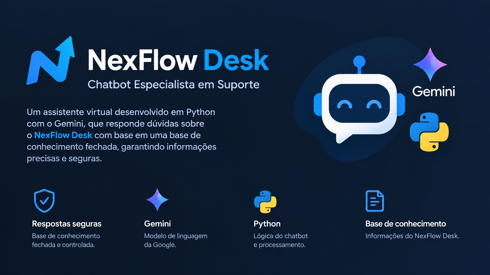

# Chatbot com Gemini — NexFlow Desk

<p align="center">
  
</p>

## Visão geral

Este projeto implementa, em **Python no Google Colab**, um chatbot especialista...

## 1. Visão geral

Este projeto implementa, em **Python no Google Colab**, um chatbot especialista para atendimento sobre um serviço fictício chamado **NexFlow Desk**.

O objetivo do projeto é demonstrar como inserir informações específicas e internas em um LLM e limitar suas respostas ao conteúdo disponibilizado, evitando que o modelo complete lacunas com conhecimento externo.

O chatbot possui:

- **Google Gemini** como provedor do LLM;
- chave de API carregada por meio de um arquivo `.env`;
- uma **base de conhecimento fechada** como fonte de verdade;
- regras explícitas para não inventar informações;
- respostas em linguagem profissional e objetiva;
- limite de **3 perguntas por sessão**;
- geração de um **resumo ao final da terceira resposta**;
- encerramento automático da conversa após o resumo;
- comando `sair` para encerrar a sessão antes das três perguntas.

> **Observação:** como qualquer aplicação baseada em LLM, o prompt e o código reduzem o risco de alucinação, mas não constituem uma garantia matemática de comportamento perfeito. Neste projeto, a principal estratégia é restringir explicitamente a fonte de informação à base de conhecimento fornecida e não habilitar consulta a fontes externas.

---

## 2. Domínio escolhido

O domínio adotado é o **NexFlow Desk**, um serviço fictício de suporte gerenciado para pequenas empresas.

As informações utilizadas pelo chatbot representam procedimentos internos do serviço, como:

- abertura de chamados;
- classificação de prioridade;
- alteração de prioridade;
- acompanhamento de chamados;
- reabertura de chamados.

Também existem informações que **não estão disponíveis na base**, como:

- SLA em horas;
- telefone do suporte;
- preços e planos;
- procedimentos de cancelamento;
- integrações com outros softwares;
- detalhes técnicos de infraestrutura.

Quando uma pergunta não puder ser respondida de forma segura usando somente a base de conhecimento, o chatbot deve informar:

> "Essa informação não está disponível na base de conhecimento do NexFlow Desk. Por favor, abra um chamado com o suporte."

---

## 3. Arquitetura simplificada

O funcionamento pode ser representado da seguinte maneira:

```text
Usuário
   ↓
Pergunta
   ↓
Python controla a sessão
   ↓
Histórico da conversa
   +
SYSTEM_INSTRUCTION
   ↓
Google Gemini
   ↓
Resposta baseada na base de conhecimento
   ↓
Contador de perguntas
   ↓
Após a 3ª pergunta
   ↓
Resumo do atendimento
   ↓
Conversa encerrada
```

Um ponto importante é que o **controle das três perguntas é feito pelo Python**, e não apenas por uma instrução para o LLM.

---

## 4. Tecnologias utilizadas

- **Python**
- **Google Colab**
- **Google Gemini**
- Biblioteca `google-genai`
- Biblioteca `python-dotenv`
- Arquivo `.env` para configuração da API

---

## 5. Estrutura do projeto

A estrutura recomendada do repositório é:

```text
chatbot_especialista_gemini/
│
├── Trabalho_Chatbot_IA.ipynb
├── .env.example
├── .gitignore
├── requirements.txt
└── README.md
```

### Função de cada arquivo

| Arquivo | Finalidade |
|---|---|
| `Trabalho_Chatbot_IA.ipynb` | Notebook principal executado no Google Colab |
| `.env.example` | Modelo das variáveis necessárias, sem a chave real |
| `.gitignore` | Impede o versionamento do `.env` |
| `requirements.txt` | Lista das bibliotecas utilizadas |
| `README.md` | Documentação e instruções do projeto |

---

## 6. Configuração da API

### 6.1. Criar a chave

É necessário possuir uma chave de API para utilizar o Gemini.

A chave deve ser criada no ambiente de gerenciamento da API do Google/Gemini.

**Nunca envie a chave de API para o GitHub, README ou para outra pessoa.**

---

## 7. Configuração do `.env`

O repositório deve possuir um arquivo:

```text
.env.example
```

com o seguinte conteúdo:

```env
GOOGLE_API_KEY=
GEMINI_MODEL=gemini-3.6-flash
```

O arquivo real utilizado localmente deve ser:

```text
.env
```

com a chave preenchida:

```env
GOOGLE_API_KEY=SUA_CHAVE_AQUI
GEMINI_MODEL=gemini-3.6-flash
```

O `.env` **não deve ser versionado**.

### Importante no Google Colab

O notebook foi configurado para receber o `.env` por upload.

Portanto:

- ` .env.example` serve apenas como modelo;
- o arquivo enviado ao Colab deve se chamar **exatamente `.env`**;
- não selecione `.env.example` no upload.

Caso o Colab mostre algo como:

```text
Saving .env.example to .env (1).example
```

isso significa que o arquivo selecionado não é o `.env` real esperado pelo código.

---

## 8. Como executar no Google Colab

### Passo 1 — Abrir o notebook

Abra o arquivo:

```text
Trabalho_Chatbot_IA.ipynb
```

no Google Colab.

### Passo 2 — Instalar as bibliotecas

Execute a célula de instalação:

```python
!pip -q install -U google-genai python-dotenv
```

Essa etapa instala:

- `google-genai`
- `python-dotenv`

### Passo 3 — Enviar o `.env`

Execute a célula de upload.

O Colab solicitará um arquivo do computador.

Selecione:

```text
.env
```

e **não**:

```text
.env.example
```

A célula verifica se o arquivo `.env` foi realmente carregado.

### Passo 4 — Carregar as variáveis de ambiente

Execute a célula responsável por:

- ler o `.env`;
- carregar `GOOGLE_API_KEY`;
- definir `GEMINI_MODEL`;
- verificar se a API key foi encontrada.

Ao final, deverá aparecer algo semelhante a:

```text
Modelo configurado: gemini-3.6-flash
API key carregada: OK
```

### Passo 5 — Inicializar o cliente Gemini

Execute a célula que cria:

```python
client = genai.Client(api_key=GOOGLE_API_KEY)
```

### Passo 6 — Carregar a personalidade e a base de conhecimento

Execute a célula contendo `SYSTEM_INSTRUCTION`.

Nessa parte estão:

- personalidade;
- objetivo;
- tarefa;
- regras anti-alucinação;
- base de conhecimento.

### Passo 7 — Carregar as funções do chatbot

Execute a célula contendo as funções:

```python
gerar_resposta()
responder()
```

### Passo 8 — Executar o chatbot

Execute a célula final.

O sistema exibirá:

```text
Assistente: Olá! Sou a Lara, especialista do NexFlow Desk. Como posso ajudar?
```

Depois, digite as perguntas no campo:

```text
Você:
```

---

## 9. Limite de três perguntas

O contador da conversa é controlado pelo Python:

```python
contador = 0
```

A cada pergunta válida:

```python
contador += 1
```

Quando:

```python
contador == 3
```

o chatbot:

1. gera a terceira resposta;
2. solicita um resumo;
3. adiciona o resumo à resposta final;
4. altera `encerrado` para `True`;
5. encerra a sessão.

A resposta final possui a estrutura:

```text
Resposta da terceira pergunta

Resumo do atendimento:
...

Conversa encerrada após 3 perguntas.
```

---

## 10. Nova conversa

No Google Colab, as variáveis permanecem na memória enquanto o ambiente estiver ativo.

Por isso, a célula de execução do chatbot reinicializa:

```python
contador = 0
encerrado = False
historico = []
```

Assim, para iniciar uma nova conversa:

**execute novamente a célula final do chatbot.**

Não é necessário reiniciar o ambiente do Colab.

---

## 11. Estratégia anti-alucinação

A proteção principal está na instrução:

```text
Responda somente o que puder ser sustentado pela BASE DE CONHECIMENTO.
```

Também são definidas as seguintes restrições:

- a base de conhecimento é a única fonte autorizada;
- o modelo não deve utilizar conhecimento geral para preencher lacunas;
- não deve consultar fontes externas;
- não deve inventar procedimentos;
- não deve criar preços, prazos, contatos, telas ou funcionalidades não presentes na base;
- quando a informação não estiver disponível, deve utilizar a mensagem definida no prompt.

Isso permite testar o comportamento do chatbot diante de uma pergunta conhecida e de uma pergunta sobre um assunto ausente da base.

---

## 12. Controle do modelo

A função principal utiliza:

```python
temperature=0
```

para reduzir variação nas respostas.

Também foi configurado:

```python
max_output_tokens=1000
```

para fornecer espaço suficiente para respostas com vários passos.

O projeto utiliza ainda:

```python
thinking_config=types.ThinkingConfig(
    thinking_budget=0
)
```

A intenção é evitar consumo do orçamento de saída com etapas de thinking em um chatbot que, neste trabalho, precisa principalmente seguir regras e consultar uma base de conhecimento fechada.

Para o resumo, é utilizado um limite menor:

```python
max_output_tokens=500
```

## 13. Segurança da chave da API

Nunca faça commit do arquivo:

```text
.env
```

O arquivo `.gitignore` deve conter:

```gitignore
.env
```

Somente o arquivo:

```text
.env.example
```

deve ser disponibilizado no repositório.

O `.env.example` deve possuir apenas os nomes das variáveis:

```env
GOOGLE_API_KEY=
GEMINI_MODEL=gemini-3.6-flash
```

e nunca a chave verdadeira.

---

## 14. Resultado esperado

Ao executar corretamente o notebook, o sistema deverá:

1. iniciar a atendente Lara;
2. receber até três perguntas;
3. responder com base exclusivamente na base de conhecimento;
4. recusar informações que não estejam disponíveis;
5. gerar um resumo após a terceira resposta;
6. encerrar a conversa;
7. permitir uma nova sessão quando a célula final for executada novamente.

---

